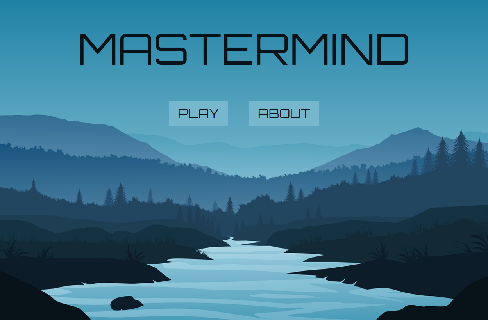
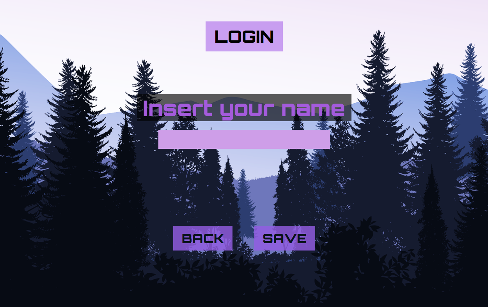
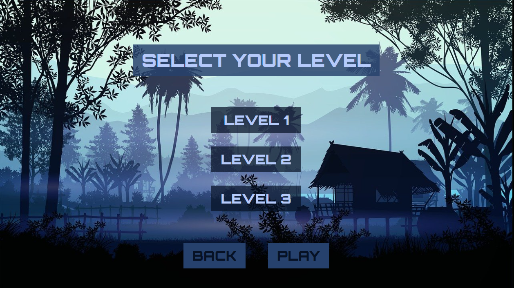

# 🎮MASTERMIND🎮

Este proyecto ha sido creado con el uso de:

## Información

Esta aplicación esta MPA con el objetivo de ser consumible por múltiples plataformas.

Este proyecto cuenta con una pantalla principal en la que se podrá acceder tanto a las instrucciones como a la página de registro mediante un botones.

Dentro de la pantalla de login encontrarás un lugar donde insertar tu nombre para acceder a los distintos niveles.

Selección del nivel de dificultad

## Instrucciones

El juego consiste en acertar la combinación generada de forma aleatoria mediante JavaScript, para ello es necesario rellenar fila a fila con los seis colores establecidos.

Los distintos niveles del juego muestran empezando desde abajo un botón "check" que se usará para realizar la comprobación. Al presionar el botón también se sube automáticamente a la fila de arriba de la fila rellenada.

El siguiente elemento que encontramos en la pantalla es una fila compuesta de seis colores diferentes, estos colores predeterminados son los que usaremos a continuación.

A continuación encontramos una fila de cuatro, cinco o seis casillas dependiendo del nivel de dificultad, serán estas las casillas que deberemos rellenar. A la derecha de estas casillas encontramos su equivalente en número, pero de un tamaño más pequeño, estas cambiarán su color a blanco en caso de que tengamos algún color que coincida con el patrón de color creado internamente por JavaScript. Al acertar la posición de uno de los colores se mostrará de color negro. 
⚠️La posición de las bolas blancas y negras no coinciden con la posición de la casilla a la que hacen referencia. Esta función se desarrollará en un futuro con el objetivo de crear un nivel más fácil.⚠️

### Información adicional

Este proyecto cuenta con las ilustraciones de: Chakkree_Chantakad

https://pixabay.com/es/users/15107399/?tab=all&order=latest&pagi=1

Mi intención es continuar desarrollando esta aplicación con el objetivo de ser subida a las distintas plataformas. Continuamos con su desarrollo

<iframe src="https://giphy.com/embed/XIqCQx02E1U9W" width="100%" height="100%" style="position:absolute" frameBorder="0" class="giphy-embed" allowFullScreen></iframe>

